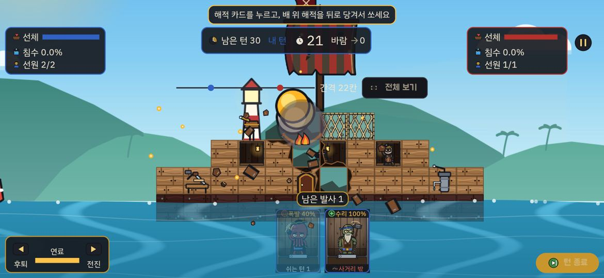
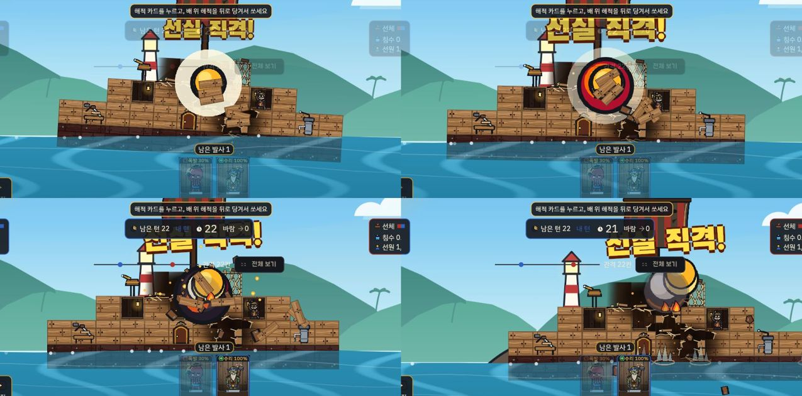
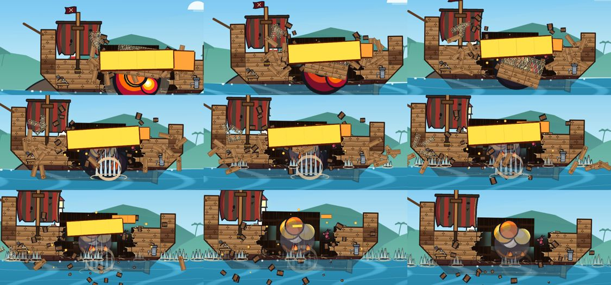
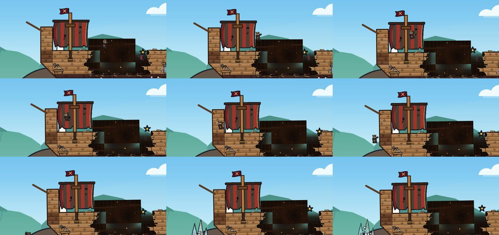

# 전투 타격감 전후 비교 (A32, 2026-10-06)

계획: [docs/plans/2026-10-06-quality-4-hit-feel.md](../plans/2026-10-06-quality-4-hit-feel.md) · 1차 진단: [2026-10-02-gap-analysis.md](2026-10-02-gap-analysis.md)

## 방법
- `feat/A32-hit-feel` 을 웹 릴리스로 빌드했다.
- 헤드리스 Chrome 에서 원격 디버깅(CDP)으로 실제로 끌어 쏘며 80~90ms 간격으로 연속 캡처했다.
- 장면은 1차 진단과 같은 튜토리얼 1이다. 옥토 폭발탄으로 상대 배 선실을 맞혔고, 상대 턴의 내 배 착탄과 빗나간 탄도 찍었다.
- 헤드리스라 소리와 진동은 확인하지 못했다. 확인할 수 있는 것은 단위 테스트(`impact_sound_test`·`aim_ticks_test`·`battle_settings_test`)뿐이고, 실기기 확인은 이월이다.

## 같은 장면: 내 폭발탄이 상대 배에 명중

| 전 (2026-10-02, A13 상태) | 후 (A32) |
|---|---|
|  |  |

| 항목 | 전 | 후 |
|---|---|---|
| 멈춤 | 0.07초 고정 | 한 방 크기에 비례해 0.05~0.16초. 묵직하면 멈춘 동안 화면이 떨린다 |
| 흔들림 | 계열별 고정 3~12px, 위치만 | 충격량² × 24px에 작은 기울기. 연달아 맞으면 쌓이되 상한이 있다 |
| 당기는 줌 | 6% 고정, 선형 | 4~12%. 0.05초에 당기고 0.3초에 걸쳐 부드럽게 푼다 |
| 부서진 칸 | 바로 사라지고 판자 파편 4개만 남는다 | 타일 그림이 판자 3장(철판 4조각)으로 갈라져 튀고 돌며 떨어진다(캡처 오른쪽 위·왼쪽 아래) |
| 묵직한 한 방 | 충격파 없음 | 흰 충격파 고리가 생긴다(캡처 1·2) |
| 선실 직격 | 연출 없음 | '선실 직격!' 큰 문구가 뜨고, 화면이 0.6초 동안 0.3배로 느려진다 |
| 붕괴 | 칸마다 따로 직선으로 떨어진다 | 이웃 칸을 한 덩어리로 묶어 기울며 떨어진다. 덩어리마다 0.08초씩 늦게 떨어지고, 물에 닿으면 흔들린다(테스트로 확인) |
| 피해 숫자 | 18pt 노랑 하나 | 작음(흰)·큼(주황, 흔들림)·치명(빨강) 세 단계. 작아지며 사라진다 |
| 소리 | 착탄에 포성을 다시 쓴다 | 쾅(크기별) + 재질 + 묵직하면 잔향을 겹친다. 해적 피격·첨벙·KO 소리, 내려오는 탄의 휘파람 |
| 발사 | 반동만 있다 | 포구 불꽃·연기가 터진다. 당길 때 힘 링 눈금마다 진동, 최대 힘에서 딸깍 |
| 빗나감 | 물보라 한 장 | 물기둥, 물방울, 가벼운 흔들림 |

## 캡처에서 찾아 고친 것
- **강조 문구가 위쪽 HUD 와 겹쳤다.** 캡처 3·4 는 고치기 전 빌드다. 카메라가 물러나면서 월드에 뜬 문구가 턴 표시줄과 겹쳤다. 문구를 맞은 곳 40px 위로 낮추고, 착탄에 머무는 동안(0.85초)만 띄우게 고쳤다. 다시 빌드해 확인했다.
- **포구 섬광을 줄였다.** 22px, 0.07초로 했다.
- 발사 직후 해적 손에 보이는 노란 원은 옥토가 든 폭탄 그림이다. 포구 불꽃이 아니며, 원래 있던 것이다.

## 남은 문제 (A32 범위 밖, 기록만)
- **상대 턴이 끝나는 순간 내 카드가 착탄 지점을 가린다.** 상대 탄이 내 뱃머리에 맞으면, 착탄과 동시에 내 턴이 시작되어 아래쪽 카드 두 장이 다시 진하게 나타나 폭발을 덮는다. A17 의 연출 중 HUD 흐림이 아래쪽 카드에는 걸리지 않는다. 고치려면 착탄에 머무는 동안 카드도 흐리게 해야 한다(§13.4).
- **이동 한계 등대가 상대 배 갑판 앞에 그려진다.** 1차 진단 때와 같은 자리다. A16 에서 `LimitMarks` 를 배 뒤로 옮겼는데도 배 왼쪽 위에 겹쳐 보인다. 등대 위치가 배 안쪽에 오는 경우로 보인다.

## 붕괴·해적 반응 (게임 렌더러에 이벤트를 넣어 뽑음)
- 튜토리얼과 더미배 연습에서 손으로 겨냥해서는 지지가 끊기는 붕괴를 만들지 못했다. 그래서 실제 `BattleGame` 렌더러(실제 그림·연출 코드)에 이벤트를 직접 넣어 프레임을 PNG 로 뽑았다.
  - 상대 배 가운데 세 칸 폭 덩어리 둘레를 부수는 이벤트(`blockDestroyed`)와 덩어리 붕괴 이벤트(`blockCollapsed`)를 넣었다.
  - 해적 피해 120, 바다 추락, 쓰러짐 이벤트도 넣었다.
  - 캡처용 임시 테스트는 지웠다.
- 테스트 환경 글꼴(Ahem)이라 피해 숫자·문구는 노란 사각형으로 보인다. 큰 주황 숫자가 흔들리는 모양만 본다.

| 붕괴 (1/30초 × 3 간격) | 해적 바다 추락·KO |
|---|---|
|  |  |

- 붕괴: 둘레 칸이 판자 조각으로 흩어진다. 그물 칸을 포함한 덩어리는 한 몸으로 기울며 선체 안쪽으로 떨어진다(윗줄 오른쪽). 조각은 물에 떨어져 작은 물보라를 낸다(아랫줄).
- 해적: 선실에서 돛 위로 솟았다가 떨어지는 자세로 뱃머리 앞 바다에 닿고, 그때 물보라가 난다. 쓰러진 해적 머리 위에는 별이 돈다(오른쪽 끝).
- 이 캡처로 고친 것: 포물선 꼭대기를 48 → 90px 로 올렸다. 처음에는 갑판을 따라 미끄러져 보였다. KO 별도 14 → 22px 로 키웠다. 너무 작아 안 보였다.
- 흰 번쩍임(해적·맞은 칸)은 0.1초라 이 간격의 캡처에는 잡히지 않는다. 테스트로 확인했다(`crew_reactions_test`).

