# A25 에이전트 플레이 점검: 퀄리티 3차 전후 비교 (2026-10-06)

계획: [docs/plans/2026-10-02-quality-3-fun.md](../plans/2026-10-02-quality-3-fun.md) A25. 지난 진단: [2026-10-02-gap-analysis.md](2026-10-02-gap-analysis.md)

> **결론부터.**
> - 퀄리티 3차(A26~A31)로 **첫 판이 "사건"이 됐다.** BEFORE 튜토리얼 1은 31턴 끝까지 가서 "침수 0% · 0%" 시간 판정으로 끝났다. AFTER는 기둥 한 방에 위층이 통째로 무너지고 격침으로 끝났다. 1-1도 BEFORE는 시간 판정, AFTER는 격침이었다.
> - 배 모양(V 선체·돛대 칸·돛단배), 손가락 안내, 다음 목표 카드, 상대 배 미리보기, 보스 배너, 말풍선이 모두 실제 화면에 나왔다.
> - 새로 드러난 큰 문제는 세 가지다. ① **"다시 하기" 뒤 판이 끝나면 결과가 저장되지 않고 화면이 멈춘다**(두 빌드 공통 버그). ② **내 턴의 절반은 할 일이 없다**(문어 쉬는 턴 + 톡 사거리 밖). ③ **상대가 위협이 안 된다.** AFTER 1-1·1-5에서 받은 피해가 0이고, 1-5 보스는 12턴 만에 별 3개로 끝났다.

## 방법
- **빌드**
  - BEFORE: `2c91e0e`(퀄리티 3차 직전 main)
  - AFTER: `39aee06`(A31 병합 main)
  - 둘 다 임시 `flutter create --platforms=web` 뒤 `flutter build web --release`로 만들었다. 생성 파일은 지웠다.
- **실행:** 포트를 나눠 띄우고, 헤드리스 Chrome(puppeteer-core)으로 1170×540·2배 밀도에서 좌표로 조작했다. 캡처를 직접 보며 다음 동작을 정했다.
  - 처음에는 SwiftShader 소프트웨어 렌더를 썼다. 그런데 캡처 한 장에 3~8초가 걸려 25초 턴 안에 쏘지 못했다. 그래서 GPU(ANGLE d3d11)로 바꾸고 한 번에 한 빌드만 돌렸다.
- **조준:** 카드를 누르고 확대된 배 위 해적을 뒤로 끌었다(새총). 거리 22칸에서는 (−222, +88)px 당기기가 잘 맞았다.
  - 턴 반복은 "내 턴 감지 → 카드 → 당기기 → 2.5초 뒤 캡처 → 턴 종료"로 자동화했다.
- **진행 건너뛰기:** 시간을 줄이려고 브라우저 IndexedDB의 진행 JSON을 직접 고쳤다. 두 빌드에 같은 값을 넣었다.
  - 튜토리얼 2·3 클리어: `tutorialDone 3`, `matchesPlayed 3`
  - 1-2~1-4 클리어: 별 2개씩, 골드 450
  - 그래서 튜토리얼 2(AFTER만 직접 플레이)·3, 1-2~1-4는 직접 하지 않았다.
- **한계**
  - 자동 조작이라 사람의 조준 시간·실수와 다르다. 벽시계 시간에는 조작 지연(내 턴당 약 13초 고정)이 들어 있다.
  - 사람 손맛 20판과 실기기 확인을 대신하지 않는다.
  - 소리는 헤드리스 웹에서 초기화에 실패해 확인하지 못했다(`효과음 초기화 실패 … Null check`, 두 빌드 공통, 웹·헤드리스 환경 문제일 수 있음).

## 장면별 전후 비교
| 장면 | BEFORE (2c91e0e) | AFTER (39aee06) | 관찰 |
|---|---|---|---|
| (a) 첫 실행·프롤로그·지도 | 같음 | 같음 | 프롤로그 5컷·건너뛰기·지도는 바뀐 것이 없다. 지도 제목 "캠페인 · 열대 만"과 노드 이름의 외곽선이 글자마다 검은 상자처럼 보이고, 튜토리얼 노드는 "튜토리얼 …"로 잘려 몇 번째인지 안 보인다(두 빌드) |
| (b) 튜토리얼 1 시작 | 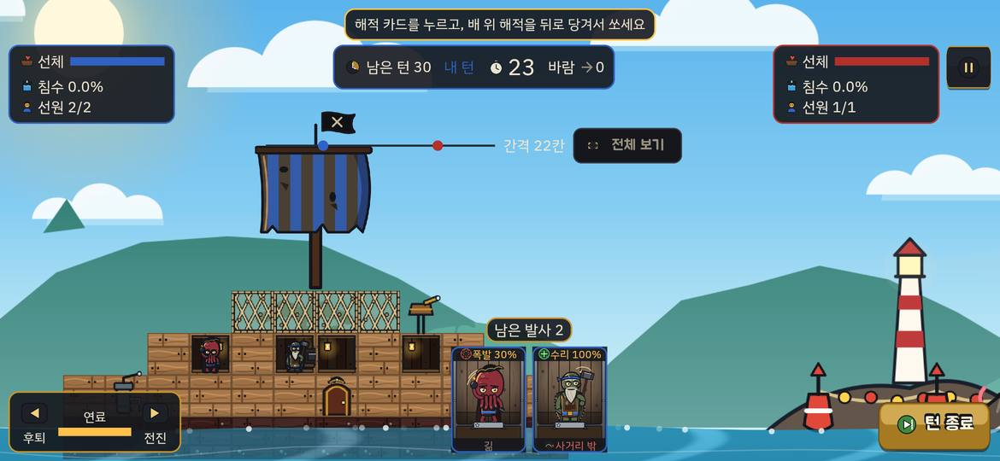 | 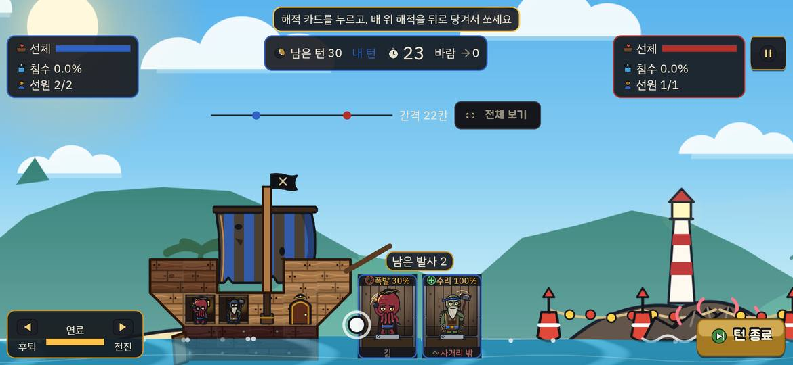 | AFTER: 6×5 돛단배(V 선체·판자 이음·선수 기움대), 돛대가 칸으로 서 있다. 카드 위에 손가락 안내 원이 뜬다. BEFORE: 12×8 직사각형 배, 돛은 선체 위에 떠 있는 장식 |
| (b) 첫 명중 | 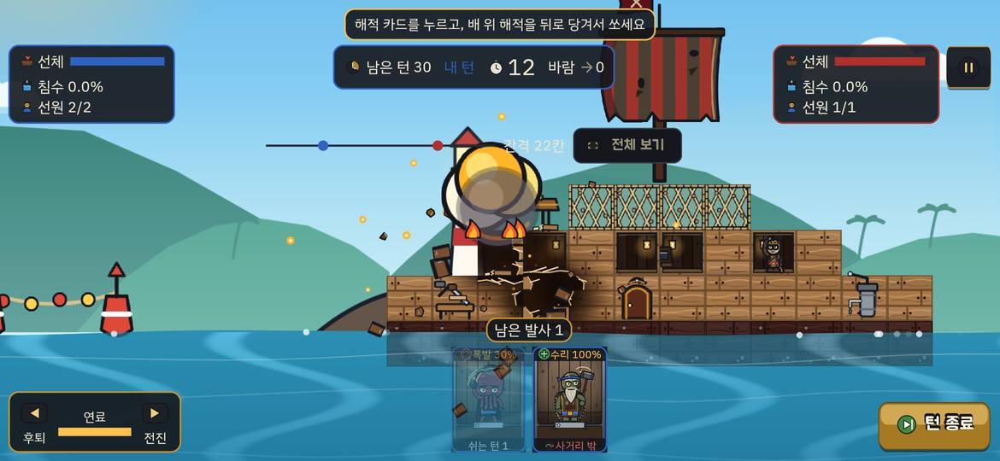 | 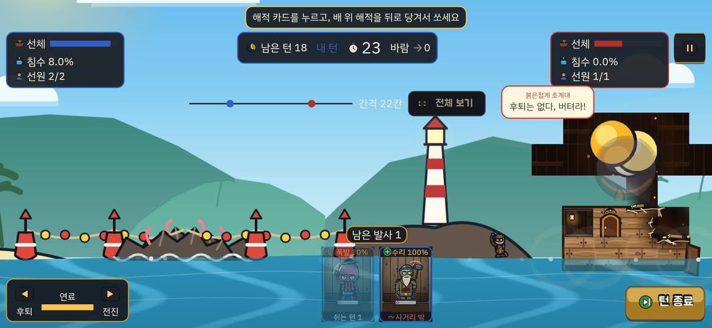 | BEFORE: 구멍 하나. AFTER: T자 적 배의 기둥을 맞히자 위층이 통째로 무너지고 상대 해적이 바다로 떨어졌다. 상대 체력이 약 100% → 40%로 떨어졌고, 상대 선장 말풍선 "후퇴는 없다, 버텨라!"가 나왔다. 다만 처음 두 발은 위층 왼쪽만 맞아 무너지지 않았다(기둥을 맞혀야 한다) |
| (b) 상대 턴 | 약 5초 | 약 5초 | 두 빌드 모두 상대 턴은 짧다(턴 종료 → 내 턴까지 5~8초). 기다림은 문제가 아니다. 문제는 상대 포격이 거의 안 맞는다는 것이다(아래 지루한 순간) |
| (c) 항구 (튜토리얼 뒤) | 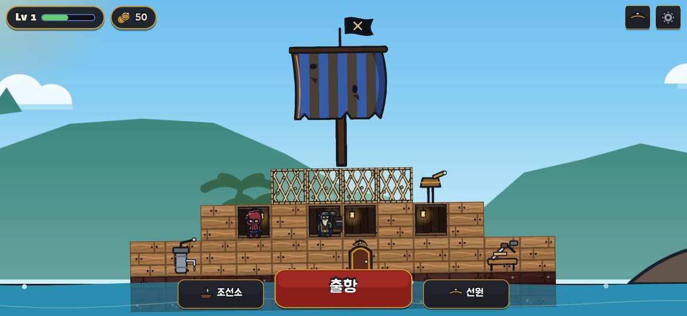 | 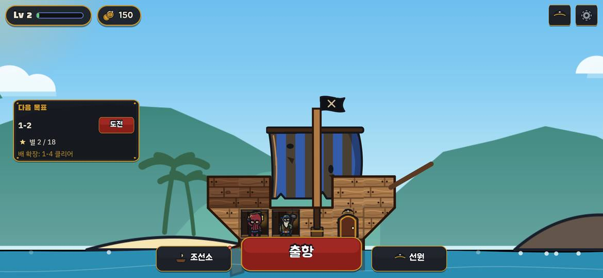 | AFTER: 왼쪽 '다음 목표' 카드(1-2·별 2/18·배 확장: 1-4 클리어·도전), 조선소 버튼의 빨간 점 "3". 빨간 점이 지름 약 6px로 작고, 출항 버튼 모서리에 붙어 잘 안 보인다 |
| (d) 조선소 | 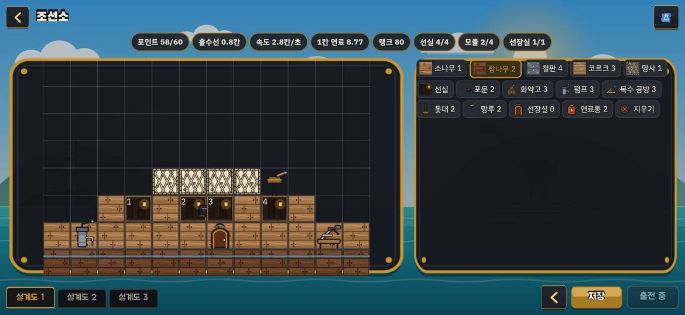 | 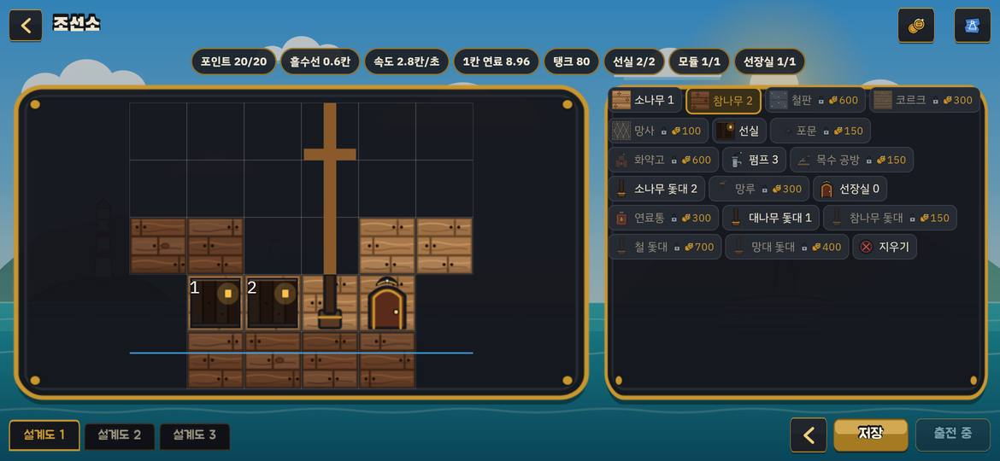 | AFTER: 6×5 틀, 잠긴 칩에 자물쇠·금액(철판 600·코르크 300 …), 돛대 5종. 오른쪽 위 업그레이드 창에서 '배 키우기' 150골드를 사자 "배가 커졌다! 작은 슬루프 · 8×6칸 · 선실 3칸" 알림이 나오고 격자가 8×6으로 커졌다. 업그레이드 창에는 효과 설명이 없다 |
| (e) 전투 준비 1-1 | 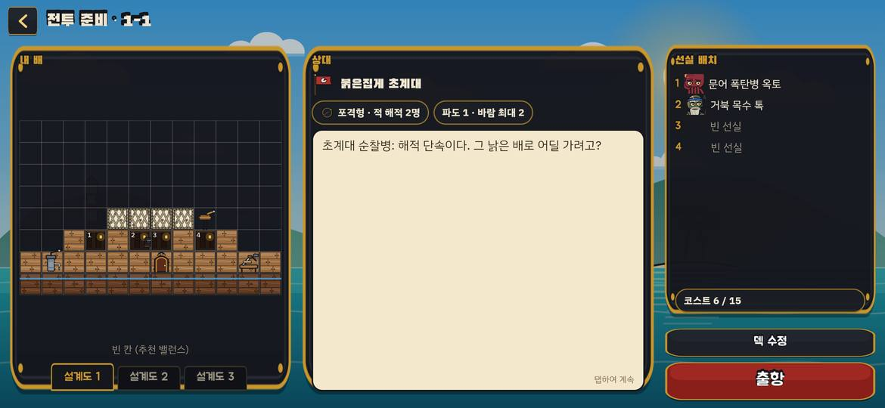 | 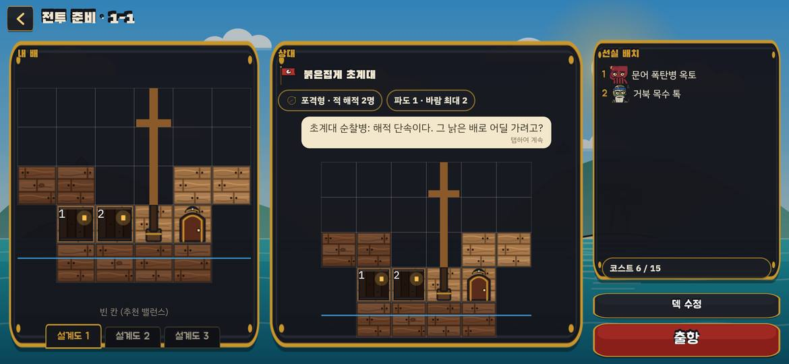 | AFTER: 상대 배 미리보기와 대사 말풍선. BEFORE는 상대 패널의 60%가 빈 대사 상자. 1-5에서는 기믹 칩(빨간 테두리)과 방패 철판 칸이 미리보기에 보인다 |
| (f) 1-1 전투·돛대 부러짐 | 돛대가 장식이라 맞지 않는다 | 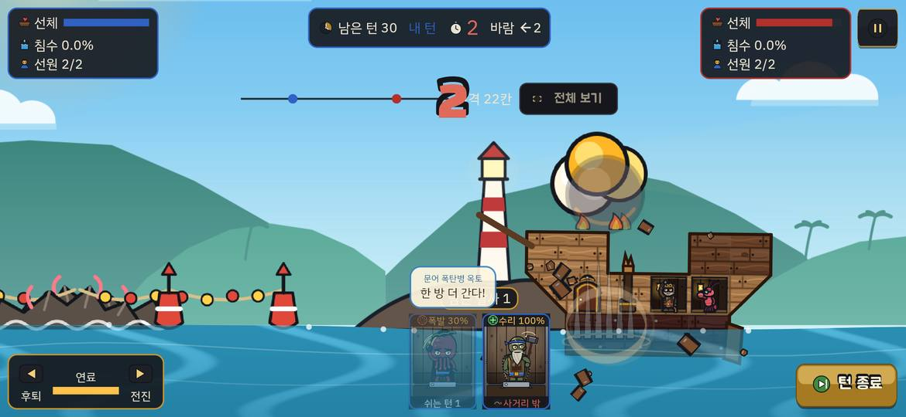 | AFTER: 첫 발에 상대 돛대가 부러져 넘어가고 판자 파편이 튄다. 해적 말풍선 "한 방 더 간다!" "받아라!", 상대 "물이 샌다! 펌프를 돌려!"가 나왔다. 말풍선이 '남은 발사' 표시와 카드 위를 가린다 |
| (g) 1-5 보스 | 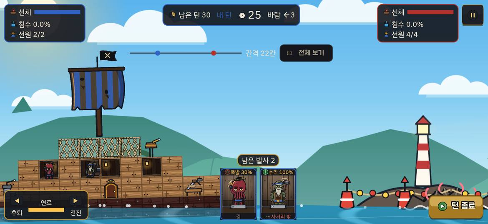 | 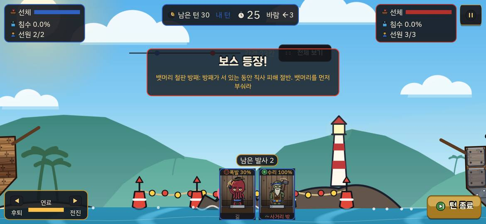 | AFTER: 보스 컷신 → "보스 등장!" 배너(기믹 설명), 뱃머리 철판 덧댐. 배너가 거리 막대·전체 보기 위를 덮고, 그동안 턴 타이머가 흐른다. BEFORE: 기믹이 글자로만 있고 배너가 없다 |

## 판당 시간
벽시계는 출항 버튼부터 결과 화면까지다. 자동 조작이라 사람보다 내 턴이 짧다.

| 판 | BEFORE | AFTER |
|---|---|---|
| 튜토리얼 1 | 약 237초 · 31턴 · **시간 판정 승리**(침수 0% · 0%) · 11발 54% | 약 255초 · 24턴 · **격침 승리** · 6발 83% (처음 4턴은 도구 지연으로 날림) |
| 튜토리얼 2 | (건너뜀) | 1차 약 325초 · 31턴 · 시간 판정 **패배**(침수 나 36% · 상대 0%, 상대 선체는 더 깎았는데 졌다). 다시 하기 약 95초 · 9턴 · 격침 승리(그러나 저장 안 됨, 버그 1) |
| 1-1 | 약 230초 · 31턴 · **시간 판정 승리**(0% · 4%) · 14발 57% | 약 227초 · 26턴 · **격침 승리** · 13발 53% · 별 2 |
| 1-5 보스 | 약 240초 · 31턴 · 시간 판정 **패배**(0% · 0%) · 3발. 28턴째 문어가 쓰러져 남은 13턴 동안 쏠 해적이 없었다 | 약 110초 · 12턴 · **격침 승리** · 5발 100% · 별 3 · 받은 피해 0 |

- AFTER는 판이 **격침으로 끝난다**. BEFORE는 세 판 모두 30턴을 다 쓰고 시간 판정으로 끝났다.
- AFTER 1-5는 너무 쉽다. 방패를 몇 번 맞혀도 5발 만에 가라앉았고, 내 배는 한 번도 맞지 않았다.

## 버그·화면 결함
| # | 빌드 | 내용 | 근거 |
|---|---|---|---|
| 1 | 둘 다 | **결과 화면 "다시 하기" 뒤 그 판이 끝나면 결과가 저장되지 않고 멈춘다.** `result_parts.dart:135`가 결과 화면을 `pop()`한 뒤 그 화면의 `ref`로 `StageFlow.play`를 부른다. 판이 끝나면 `_finish`의 `ref.read`가 이미 dispose된 ref라 예외(`PAGEERR`)를 던진다. 화면에는 전투 안 "격침! 승리! [다시 하기]" 패널만 남고 결과·보상·진행이 저장되지 않는다(진행 JSON `tutorialDone` 1 그대로) | 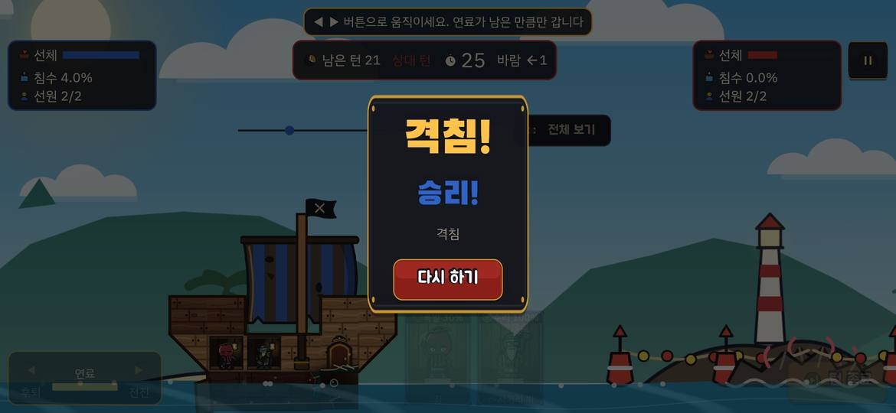 |
| 2 | 둘 다 | 토스트 글자에 노란 겹밑줄이 그어진다(Material 조상이 없는 Text). `showPbToast`(`ui/kit/pb_dialog.dart:118`)가 `OverlayEntry`에 Material·DefaultTextStyle 없이 글자를 넣는다. 예: "조선소는 4판째부터 열려요" | 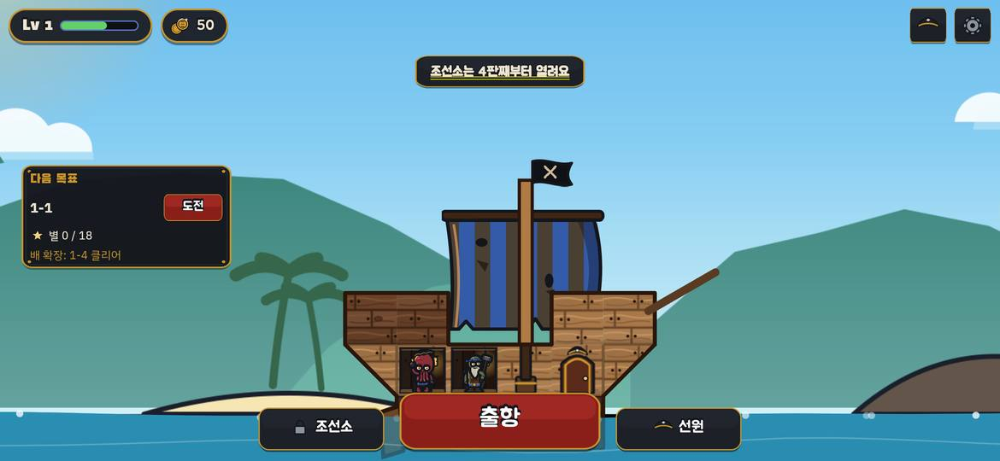 |
| 3 | 둘 다 | 패배 결과 화면의 가라앉는 배에 설계도 격자선이 보이고, 물이 모서리가 각진 반투명 사각형으로 그려진다 | 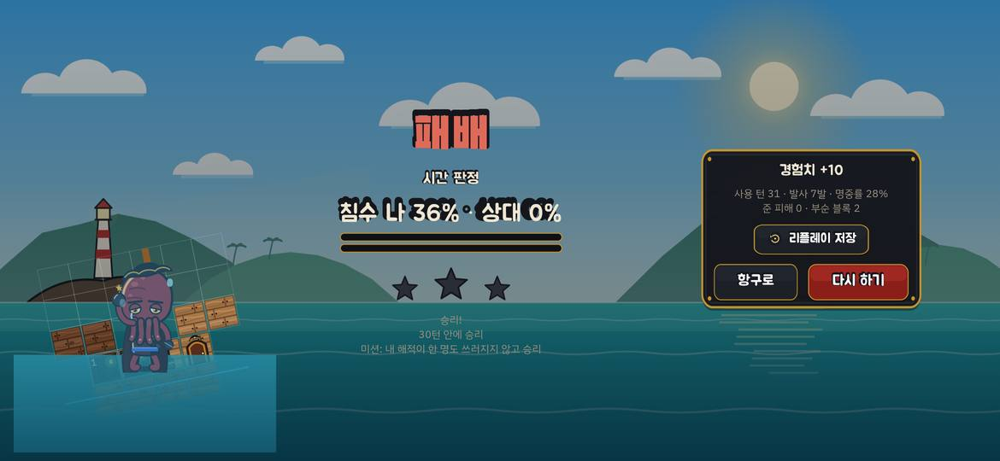 |
| 4 | AFTER | **'다음 목표' 카드로 들어가면 해역 1 인트로 컷신을 건너뛴다.** 인트로는 `CampaignMapScreen._intro()`에서만 나오는데, 카드는 `BattlePrepScreen`을 바로 연다. 튜토리얼 뒤 카드를 따라가는 새 사용자는 해역 이야기를 못 본다 | `port_screen.dart:141`, `campaign_map_screen.dart:71` |
| 5 | 둘 다 | 결과의 "사용 턴 31"이 최대 30턴을 넘는다(`MatchSummary.turns = state.turn`) | 결과 화면 |
| 6 | 둘 다 | 전투에 들어가면 웹에서 처음 3~5초(소프트웨어 렌더는 10초 넘게)는 바다·배가 검은 화면이다. 그동안 25초 턴 타이머가 이미 흐른다. 실기기에서 같은지는 확인하지 않았다 | 첫 판 캡처 |
| 7 | 둘 다 | 지도 제목·노드 이름의 외곽선이 글자마다 검은 상자처럼 보인다. 튜토리얼 노드가 "튜토리얼 …"로 잘린다 | 지도 캡처 |
| 8 | AFTER | 부서진 칸이 짙은 갈색 판으로 공중에 남는다. 무너진 위층이 그대로 떠 있는 것처럼 보이고, 무너짐 뒤 실제로 남은 배 모양을 읽기 어렵다 | 위 t-1·1-1 캡처 |
| 9 | AFTER | 1-5(큰 상대 배)에서 착탄 순간 상대 배가 화면 오른쪽 끝에 반쯤 잘린다. 카메라가 폭발 도중 내 배 쪽으로 돌아간다 | 1-5 연속 캡처 |

## 헷갈린 순간
- **이동 버튼은 꾹 눌러야 한다.** 튜토리얼 2 안내("◀ ▶ 버튼으로 움직이세요")와 손가락 원은 '누르기'로만 보여서, 세 번 눌렀는데 배가 거의 안 움직였다.
- **시간 판정은 선체가 아니라 침수로 정한다.** 튜토리얼 2에서 HUD 선체 막대는 상대가 더 많이 깎였는데, 침수 36% : 0%로 졌다. HUD에서는 선체 막대가 가장 눈에 띄어 이유를 알기 어렵다.
- **턴 단위가 섞여 보인다.**
  - "남은 턴 30"과 별 조건 "12턴 안에 승리"는 양쪽 턴을 합친 수다. 그런데 사람은 내 발사 6번으로 느낀다.
  - 결과에 "사용 턴 31"이 나온다.
  - "준 피해 0 · 부순 블록 9"처럼, 블록을 부숴도 '준 피해'가 0으로 나온다(해적 피해만 센다).
- **업그레이드 창**
  - "배 키우기: 돛단배"가 사면 무엇이 되는지가 아니라 지금 단계 이름을 보여 준다.
  - 선형·돛대 Lv 업그레이드에 효과 설명이 없다.
  - 배를 키우면 선실 3칸이 되지만 해적이 2명뿐이라 새 선실이 빈 채로 남는다.
- **배경 등대**가 자주 상대 배 바로 뒤에 겹쳐, 배 위에 서 있는 것처럼 보인다(두 빌드).

## 지루한 순간
- **내 턴의 절반은 할 일이 없다.** 문어(폭발)는 쏜 뒤 '쉬는 턴 1'이 붙는다. 거북 톡은 수리형이라 22칸에서 '사거리 밖'이다. 튜토리얼·1-1·1-5 모두 두 턴에 한 번만 쏠 수 있고, 나머지 턴은 턴 종료만 누른다(두 빌드).
- **공격 해적이 쓰러지면 끝까지 구경만 한다.** BEFORE 1-5에서 28턴째 문어가 쓰러진 뒤, 남은 13턴은 쏠 수 있는 해적이 없어 시간 판정 패배를 기다렸다.
- **상대가 위협이 안 된다.**
  - AFTER 1-1·1-5에서 내 배는 침수 0%·선체 그대로였다. 상대 턴이 5초로 짧지만 긴장이 없다.
  - BEFORE·AFTER 튜토리얼 2에서는 상대 포격에 침수가 쌓였다(36%). 판마다 위협 차이가 크다.
- **BEFORE는 30턴을 다 쓰는 판이 기본이었다**(세 판 모두 시간 판정). AFTER는 격침으로 끝나 이 문제가 많이 줄었다.

## 다음 개선 우선순위 (10)
`[규칙·수치]`는 설계서·BALANCE.md 수정 승인이 먼저 필요하다. `[앱]`은 렌더·화면·흐름만 고친다.

1. **[앱] "다시 하기" 흐름 버그를 고친다**(버그 1). 결과를 잃고 화면이 멈춘다. 재도전은 가장 흔한 행동이다. 상위 navigator·`ProviderContainer`를 넘기거나 ref 대신 컨테이너를 쓰고, 재도전 승리 위젯 테스트를 추가한다.
2. **[규칙·수치] 매 턴 쏠 거리를 보장한다.**
   - 초반 덱(옥토·톡)은 두 턴에 한 발이다. 톡은 22칸에서 쓸 일이 없다.
   - 튜토리얼·1-1 시작 거리를 톡 사거리 안으로 줄이거나, 초반 공격 해적을 하나 더 주거나, 쉬는 턴을 조정한다.
   - 공격 해적이 모두 쓰러지면 남은 턴을 줄이는 등의 마무리 규칙을 검토한다(BALANCE 사거리·쿨다운, 설계서 §2).
3. **[규칙·수치] 해역 1 상대 AI 위협과 1-5 보스 난이도를 올린다.**
   - AFTER 1-1·1-5에서 받은 피해가 0이었다. 1-5는 12턴·별 3이었다.
   - AI 다이얼(명중 오차)과 1-5 적 단계·방패 내구도를 BALANCE A부에서 다시 맞춘다. `sim_runner --stage`로 판 길이·승률을 다시 잰다.
4. **[규칙·수치 또는 앱] 시간 판정 기준을 보이게 한다.**
   - 규칙을 선체 기준으로 바꾸려면 설계서 승인이 필요하다.
   - 앱만으로는 마지막 6턴('폭풍 타임')에 HUD에 "판정: 침수가 적은 쪽"과 양쪽 침수 비교를 크게 띄운다.
5. **[앱] 부서진 칸 표현을 고친다.** 짙은 판으로 공중에 남기지 말고, 무너진 칸은 떨어져 사라지게 한다. 남은 칸만 그을림·윤곽으로 그려 남은 배 모양이 읽히게 한다(버그 8).
6. **[앱] 착탄 카메라.** 폭발이 끝날 때까지(약 0.6초) 상대 배를 화면 안에 잡고 머문 뒤 돌아간다. 큰 배(1-5)에서도 배 전체가 들어오게 한다(버그 9).
7. **[앱] 턴 타이머 시작 시점**
   - 전장 그림이 다 그려진 뒤 타이머를 시작한다(버그 6).
   - 보스 배너·컷신 직후에도 배너가 사라질 때까지 멈춘다. 설계서 §2 턴 타이머 문구에 '연출 중 정지'가 없으면 확인을 받는다.
8. **[앱] 첫 10분 다듬기**
   - 이동 안내를 "꾹 누르세요"로 바꾸고, 손가락이 누른 채 머무는 동작을 넣는다(ko·en).
   - 다음 목표 카드에서도 해역 인트로를 먼저 보여 준다(버그 4).
   - 빨간 점을 키워 버튼 안쪽 위로 옮긴다.
9. **[앱] 화면 결함 묶음:** 토스트 노란 밑줄(버그 2), 패배 화면 격자·사각 물(버그 3), 지도 외곽선·잘린 노드 이름(버그 7), "사용 턴 31"(버그 5), '준 피해' 이름(→ '해적 피해').
10. **[앱, 문구는 설계서 §13.6 확인] 업그레이드 창**
    - 항목마다 효과를 적는다(예: "선체 내구도 +1%").
    - '배 키우기'는 다음 단계 이름·크기(작은 슬루프 8×6·선실 3)를 보여 준다.
    - 키운 뒤 빈 선실이 생기면 "선원 화면에서 해적을 태우세요" 안내를 띄운다.

## 이번에 하지 못한 것
- 튜토리얼 3과 1-2~1-4는 직접 플레이하지 않았다(진행 주입). 1-12 초계선 기믹도 보지 못했다.
- BEFORE 튜토리얼 2는 하지 않았다.
- 돛 자리 해적 추락, 내 돛대가 부러지는 장면은 상대가 거의 맞히지 못해 나오지 않았다.
- 소리, 실기기 손맛, 화면 비율별 손가락 위치는 확인하지 않았다(이월 유지).
